# 加简大白话 · Plainify

加简大白话是一套在自己电脑上运行的阅读辅助工具。你可以在网页里选中看不懂的词、句子或短段落，让模型把它改写成容易理解的“大白话”，再把值得记住的内容收进个人术语库。已经收录的术语再次出现在网页中时，会自动显示黄色高亮，方便边读边复习。

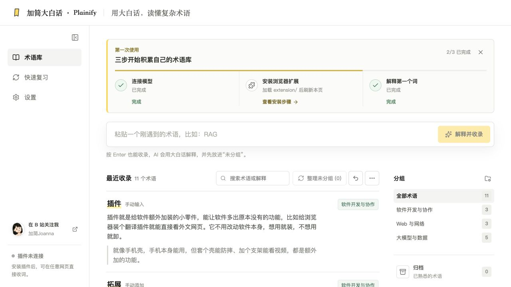

> 当前版本是本地版：网站、本机服务和浏览器扩展需要配合使用。术语和 API Key 都保存在自己的电脑上，没有账号系统和云同步。

## 目录

- [开始前需要准备什么](#开始前需要准备什么)
- [安装并启动加简大白话](#安装并启动加简大白话)
- [安装浏览器扩展](#安装浏览器扩展)
- [配置模型 API Key](#配置模型-api-key)
- [第一次解释网页内容](#第一次解释网页内容)
- [添加术语的三种方式](#添加术语的三种方式)
- [在网页中复习术语](#在网页中复习术语)
- [在术语库中集中复习](#在术语库中集中复习)
- [整理和管理术语](#整理和管理术语)
- [典型使用场景](#典型使用场景)
- [常见问题](#常见问题)
- [隐私与安全](#隐私与安全)

## 开始前需要准备什么

请先准备下面四样东西：

1. **Chrome 或 Edge 浏览器**：加简大白话的浏览器扩展目前支持这两款浏览器。
2. **Node.js 20.19 或更高版本**：这是让加简大白话在电脑上运行的基础软件。macOS 安装脚本会自动检查；如果没有安装，会打开 [Node.js 官方下载页](https://nodejs.org/zh-cn/download)。
3. **一个受支持模型服务商的 API Key**：API Key 可以理解为模型服务商发给你的“调用密码”。加简大白话用它向模型请求解释。请从服务商的官方控制台创建，不要把 Key 发给别人。
4. **已解压的完整项目文件夹**：浏览器加载扩展后不能随意移动或删除其中的 `extension` 文件夹。

当前支持的模型服务商有 DeepSeek、OpenAI、阿里云百炼、Moonshot AI 和智谱 AI。你只需要任选一个，不必全部注册。

### 三个容易混淆的概念

- **浏览器扩展**：也常被称为“浏览器插件”，就是安装在 Chrome 或 Edge 里的小工具。它负责读取你主动选中的文字、显示解释入口和黄色高亮。
- **本机服务**：在你自己的电脑上运行的后台程序。它负责安全读取 API Key，并让网站和浏览器扩展能够调用模型。本项目的本机服务只监听 `127.0.0.1`，也就是只接受这台电脑自己的连接。
- **API Key**：模型服务商用来识别调用者的一串密钥。它通常按实际使用量计费或消耗免费额度，不是加简大白话的登录密码。

## 安装并启动加简大白话

### macOS：双击安装，推荐普通用户使用

1. 在 GitHub 项目页面点击绿色的 **Code**，再点击 **Download ZIP**。
2. 在“下载”文件夹找到 ZIP 压缩包，双击解压。
3. 打开解压后的项目文件夹，找到 `install.command`。
4. 双击 `install.command`。系统会打开一个终端窗口并自动安装需要的内容，不需要在里面输入命令。
5. 等待安装结束。成功后，浏览器会自动打开 `http://127.0.0.1:5173/`，页面上会看到“三步开始积累自己的术语库”。

如果 macOS 提示“无法验证开发者”：

1. 回到项目文件夹，右键点击 `install.command`。
2. 点击 **打开**。
3. 在确认窗口中再次点击 **打开**。

安装脚本会检查 Node.js、安装项目依赖、安装登录后自动运行的本机服务，并打开网站。以后使用时，直接访问 `http://127.0.0.1:5173/` 即可。

> 安装过程中打开 Node.js 下载页，表示电脑还没有合适版本的 Node.js。完成 Node.js 安装后，重新双击 `install.command`。

### Windows、Linux 或需要手动启动时

这部分需要使用“终端”，也就是用文字命令操作电脑的窗口。如果不熟悉命令行，建议请身边熟悉电脑的人协助完成首次启动。

1. 安装 [Node.js 20.19 或更高版本](https://nodejs.org/zh-cn/download)。
2. 打开终端，进入解压后的项目文件夹。
3. 依次运行：

   ```bash
   npm ci
   npm run dev
   ```

4. 保持终端窗口开启，再用浏览器打开 `http://127.0.0.1:5173/`。
5. 成功时会看到加简大白话术语库页面；关闭运行 `npm run dev` 的终端后，网站和扩展将暂时无法连接。

macOS 用户也可以在项目文件夹的终端中运行下面两条命令，重新安装并检查常驻服务：

```bash
npm run service:install
npm run service:status
```

## 安装浏览器扩展

扩展目前通过“加载已解压的扩展程序”安装，不是从 Chrome 应用商店安装。

### Chrome

1. 在 Chrome 地址栏输入 `chrome://extensions`，按回车。
2. 打开页面右上角的 **开发者模式**。
3. 点击 **加载已解压的扩展程序**。
4. 在文件选择窗口中，打开刚才解压的项目文件夹，选中里面的 `extension` 文件夹，再点击 **选择**。
5. 成功后，扩展列表中会出现“加简大白话 · Plainify”。

### Edge

1. 在 Edge 地址栏输入 `edge://extensions`，按回车。
2. 打开 **开发人员模式**。
3. 点击 **加载解压缩的扩展**。
4. 选中项目里的 `extension` 文件夹。
5. 成功后，扩展列表中会出现“加简大白话 · Plainify”。

### 确认扩展已经连接

1. 回到加简大白话网站并刷新页面。
2. 点击左侧 **设置**，再点击 **通用设置**。
3. 在“浏览器扩展”区域查看右上角状态。成功时会从“未连接”变成“已连接”。
4. 建议点击浏览器工具栏上的扩展图标，再点击图钉，把加简大白话固定在工具栏，之后更容易找到。

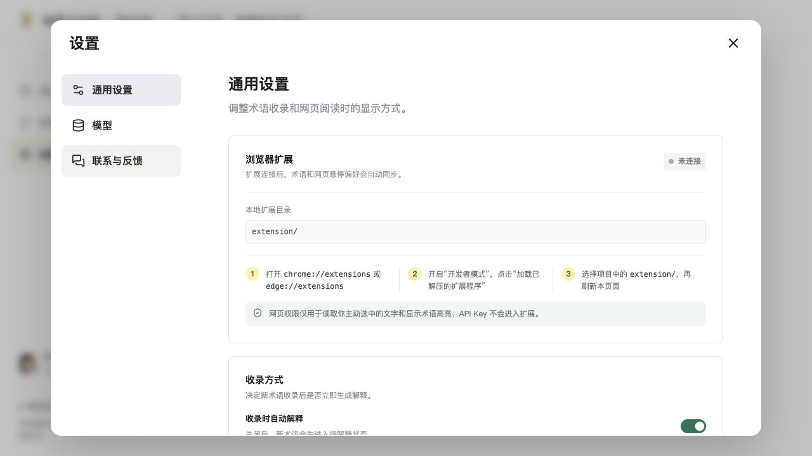

> 扩展需要网页访问权限，才能读取你主动选中的文字、显示解释按钮和标记已收录术语。API Key 不会保存到扩展里。

更新项目后，请在扩展管理页找到“加简大白话 · Plainify”，点击 **重新加载**，然后刷新已经打开的普通网页。请只保留一个同名扩展，避免重复副本互相影响。

## 配置模型 API Key

下面以任意一个服务商为例。不同服务商创建 API Key 的页面不一样，但回到加简大白话后的操作相同。

1. 打开加简大白话网站，点击左侧 **设置**。
2. 点击设置窗口左侧的 **模型**。
3. 点击 **添加模型服务**。
4. 在“模型厂商”中选择 DeepSeek、OpenAI、阿里云百炼、Moonshot AI 或智谱 AI。
5. 保持“官方 API”，使用官方地址最省事。如果你明确知道自己使用的是中转站或兼容接口，才切换到“自定义地址”并填写对方提供的地址。
6. 点击 API Key 输入框旁的 **获取 API Key**，在服务商官方控制台创建 Key。
7. 回到加简大白话，把完整 Key 粘贴进“API Key（必填）”。截图中的 `sk-...` 只是遮挡后的示意，不是真实 Key。
8. 点击 **联通测试并获取模型**。这个测试只获取可用模型列表，不会生成解释。
9. 成功后会看到“联通成功，已获取 X 个可用模型；未发起对话生成。”，并出现可选模型。
10. 选择一个模型。第一次配置时点击 **保存并开始使用**；以后添加其他服务时点击 **保存配置**。

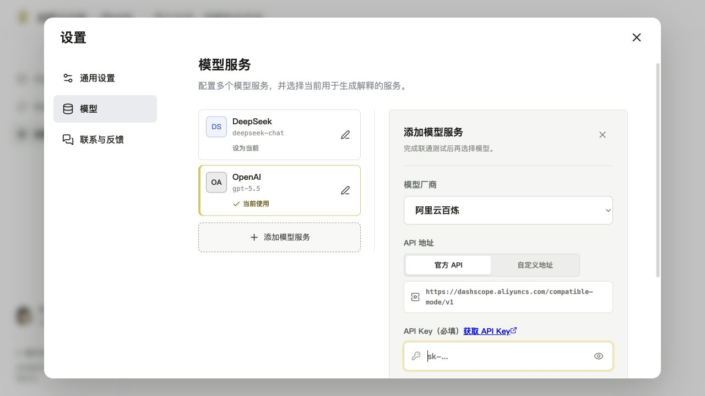

保存成功后，模型服务卡片会标记“当前使用”。网页解释窗口和扩展弹窗底部会显示“服务商 · 模型名称”，方便确认实际使用的是哪个模型。

> API Key 只会由本机服务写入项目中的 `.env.local` 文件。界面最多显示“已配置”和末四位，不会把完整 Key 发给网站页面或浏览器扩展。

## 第一次解释网页内容

配置模型并连接扩展后，可以在普通网页中完成第一次解释。

1. 打开一篇想阅读的普通网页。浏览器自己的设置页、扩展管理页、新标签页等内部页面不能运行扩展。
2. 用鼠标拖动选中一个词组、句子或短段落，最多 120 个字符。
3. 在选中文字旁边点击 **用大白话解释**。
4. 等待几秒。成功后会看到“术语解释”窗口，其中包含“大白话解释”和“生活化类比”。
5. 只想临时查看时，点击 **先不添加**；想以后复习时，点击 **加入术语库**。
6. 加入成功后，该内容会同步到术语库，并在当前网页中显示黄色高亮。

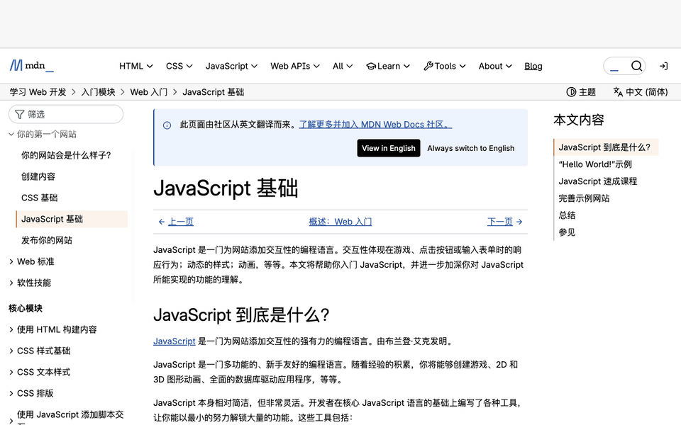

## 添加术语的三种方式

### 方式一：在网页中选中文字后添加

**适合场景：** 阅读文章时刚好遇到陌生内容，希望保留当前网页来源。

1. 在当前网页选中不懂的内容。
2. 点击旁边的 **用大白话解释**。
3. 查看解释，确认内容值得保存。
4. 点击 **加入术语库**。
5. 成功后文字会变成黄色高亮，网站术语库中会新增该术语，并保存页面标题和完整网页链接。

网页收录不会保存选中句子的完整上下文，只保存术语、解释、页面标题和网页链接。


### 方式二：在浏览器扩展中添加

**适合场景：** 已经知道要查什么，或网页上的文字不方便直接选中。

1. 点击浏览器工具栏中的加简大白话图标。
2. 在“想查询的术语”输入框中输入内容，最多 120 个字符。
3. 点击 **生成解释**。
4. 看到解释后，点击 **加入术语库**。只生成解释不会自动收录。
5. 成功后会看到已加入的状态；需要查询下一个词时，先点击 **清空**。

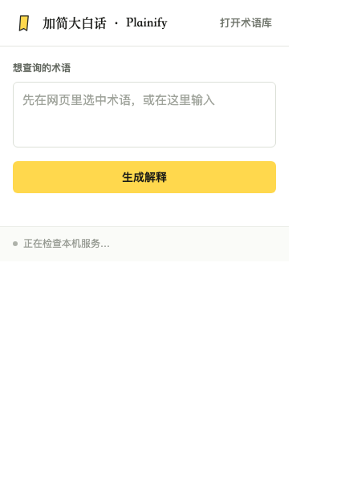

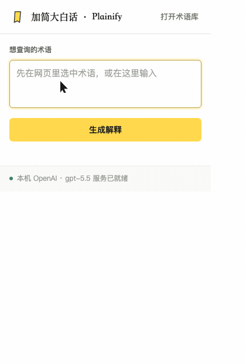

通过弹窗手动输入的术语会显示为“手动输入”，不会带有来源网页链接。弹窗会保留最近一次查询结果，关闭再打开仍可继续查看。

### 方式三：在术语库中手动输入

**适合场景：** 整理笔记、课程或会议内容时，想连续补录多个术语。

1. 打开 `http://127.0.0.1:5173/`，进入 **术语库**。
2. 在页面上方“粘贴一个刚遇到的术语，比如：RAG”输入框中输入内容。
3. 点击 **解释并收录**，也可以按 Enter 键。
4. 等待模型生成。成功后页面会提示“已经用大白话解释并收录”，新术语出现在“最近收录”中。

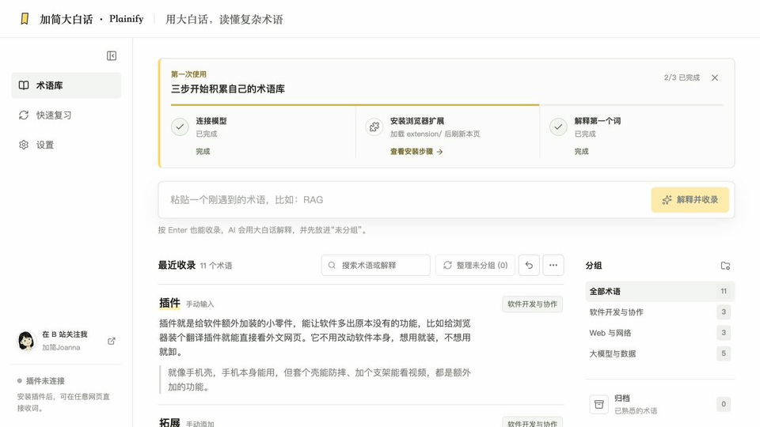

这种方式同样不会自动添加来源网页链接。如果需要，可以打开术语详情，在“来源网站 URL”中自行填写。

## 在网页中复习术语

收录后的术语再次出现在普通网页中时，扩展会帮助你在阅读过程中复习。

1. **自动高亮**：网页中的同名内容会显示黄色背景。英文匹配不区分大小写。
2. **悬停查看**：把鼠标停在黄色内容上，会出现小灯泡和解释窗口。显示内容由 **设置 → 通用设置 → 网页悬停卡片** 决定，可选择“解释和类比”“大白话解释”或“生活化类比”。
3. **点击固定**：点击黄色内容，解释窗口会固定在页面上，移开鼠标也不会消失，方便对照正文阅读。
4. **归档术语**：确认已经掌握后，在固定窗口中点击 **归档术语**。归档后窗口关闭，当前网页中的同名黄色高亮消失，术语也不再进入快速复习。
5. **返回来源**：回到术语库，在术语卡片标题旁点击带外链图标的来源名称，即可打开最初收录它的页面查看上下文。打开术语详情后，也可以在“来源网站 URL”输入框中检查或修改这个地址。

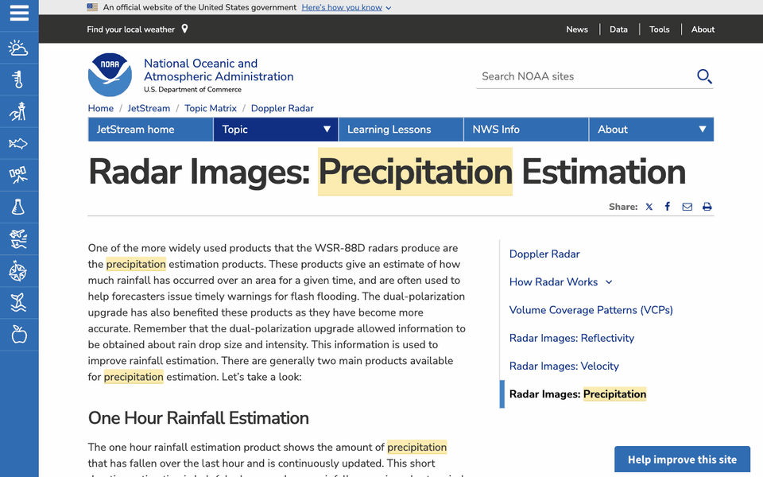

> 手动从扩展弹窗或术语库输入的内容默认没有来源链接。浏览器内部页面、禁止扩展运行的页面，以及图片或视频里的文字不会自动高亮。

## 在术语库中集中复习

快速复习适合在读完文章后，用几分钟检查自己是否还记得最近收录的内容。每轮最多显示 5 个术语。

1. 打开加简大白话网站，点击左侧 **快速复习**，也可以在术语库右侧点击 **开始快速复习**。
2. 页面先只显示术语。不要急着点开，先在心里回想它的含义。
3. 想好后点击 **想好以后，查看解释**。
4. 对照“大白话解释”和“生活化类比”。
5. 仍不确定时点击 **还不熟**；已经记得时点击 **记住了**。
6. 完成这一组后会看到“记住了 X 个，共复习 X 个”的结果。

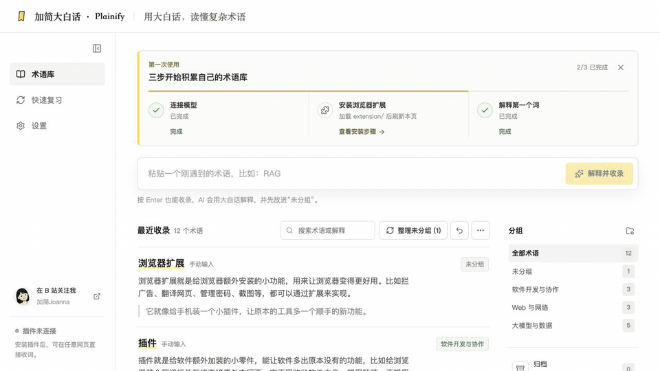

“记住了”只记录本轮复习结果，不会自动归档。确定以后不需要继续高亮和复习时，请在术语卡片、术语详情或网页固定解释窗口中执行归档。

## 整理和管理术语

### 搜索和查看详情

1. 在术语库顶部的“搜索术语或解释”输入框中输入关键词。
2. 点击一个术语卡片，右侧会打开详情。
3. 可以修改术语、解释、类比、所属分组和来源网站 URL。

### 整理未分组术语

从网页或扩展新收录的术语先进入“未分组”。

1. 在术语库点击 **整理未分组 (数字)**。
2. 等待模型给出整理建议。
3. 在预览中检查每个术语要移动到哪里。
4. 确认后应用方案。系统优先使用已有的大类，确实需要时才新建能容纳多个术语的分组，不会移动已经归类的术语。
5. 如果结果不满意，使用工具栏中的撤销按钮恢复上一次整理。

更多菜单中的 **重新整理全部术语** 会调整整个术语库，最多整理成 5 个宽泛分组，并可能删除不再使用的旧分组。操作前会先显示预览，适合偶尔整体重整，不建议频繁使用。

### 归档、恢复和永久删除

1. 点击术语卡片右上角的勾选图标，或在术语详情中点击 **归档术语**。
2. 归档成功后，术语会从首页、快速复习和网页黄色高亮中移除。
3. 点击术语库右侧的 **归档**，可以查看已归档内容。
4. 点击恢复图标可把术语放回原分组；原分组已经不存在时，会回到“未分组”。
5. 点击删除图标并确认后会永久删除。永久删除当前没有恢复入口，请谨慎操作。

## 典型使用场景

以下示例都来自无需登录即可阅读的公开页面。网页内容可能随发布方更新；示例只用于说明操作方式。

### 场景一：阅读技术文档

**遇到的问题：** 第一次学习网页制作，在文档里看到 JavaScript、HTML、CSS、API、依赖或仓库等词，不知道它们在当前句子中是什么意思。

**示例网页：** [MDN《JavaScript 基础》](https://developer.mozilla.org/zh-CN/docs/Learn_web_development/Getting_started/Your_first_website/Adding_interactivity)

**示例内容：** `JavaScript`

**怎么操作：** 在标题中选中 `JavaScript`，点击 **用大白话解释**，阅读解释和类比。确认以后还会遇到时，点击 **加入术语库**。

**得到的帮助：** 示例解释会说明 JavaScript 是让网页能够响应点击、检查表单和自动更新内容的编程语言，不只给出缩写或字面翻译。

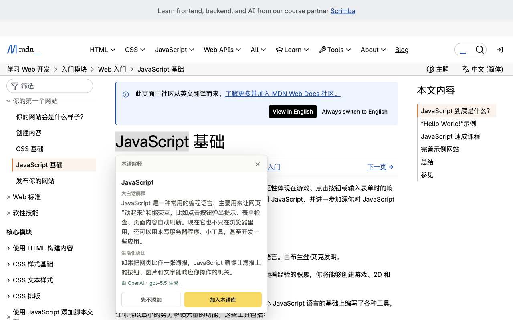

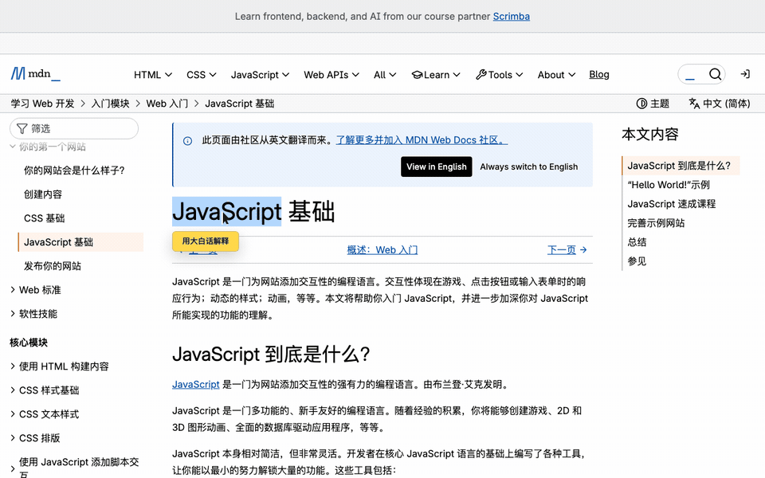

完整的选中、解释和收录过程见[第一次解释网页内容](#第一次解释网页内容)中的 GIF。

### 场景二：阅读英文文章并在下一篇文章中复习

**遇到的问题：** 阅读英文科普文章时认识大部分单词，但 `precipitation` 不熟悉，直接查词典仍不容易联系上下文。

**示例网页：** [NASA《What Is Climate Change?》](https://science.nasa.gov/climate-change/what-is-climate-change/)

**示例内容：** `precipitation`

**怎么操作：** 选中 `precipitation`，点击 **用大白话解释**。看到“降水，以及化学语境中的沉淀”等通俗解释后，点击 **加入术语库**。


之后打开 [NOAA JetStream 的 Precipitation 页面](https://www.noaa.gov/jetstream/precipitation)，同一个词会自动显示黄色高亮。鼠标悬停可复习释义，点击可固定解释；确定已经掌握后点击 **归档术语**。

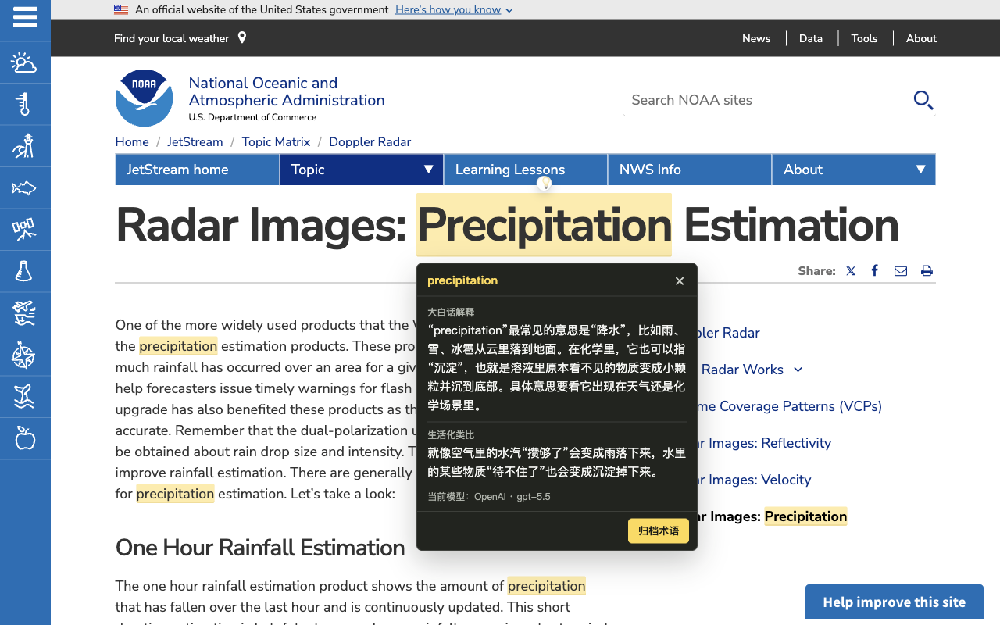

连续的高亮、悬停、固定和归档操作见[在网页中复习术语](#在网页中复习术语)中的 GIF。

### 场景三：阅读投资和财经内容

**遇到的问题：** 财经文章里出现“白马股”“ROI”“市盈率”“市净率”“净资产收益率”或“连续三年上涨 20%”，只看字面意思仍不知道指标在说什么。

**示例网页：** [MBA 智库百科“市盈率”](https://wiki.mbalib.com/wiki/%E5%B8%82%E7%9B%88%E7%8E%87)

**示例内容：** `市盈率`

**怎么操作：** 选中页面标题中的“市盈率”，点击 **用大白话解释**。解释会结合当前概念说明它大致是在比较股价与公司赚钱能力，再用小店回本时间作类比。

**得到的帮助：** 不只看到 P/E 的翻译，还能先理解这个指标想比较什么，再决定是否继续阅读专业定义。


> 本示例只用于理解术语，不构成投资建议。模型解释可能不完整或出错，不能作为买卖或资产配置依据。

### 场景四：阅读晦涩的隐私政策

**遇到的问题：** 隐私政策或用户协议句子很长，包含多个条件，读完仍不确定它对自己有什么影响。

**示例网页：** [W3C《Privacy Principles》](https://www.w3.org/TR/privacy-principles/)

**示例内容：** 摘要中一段不超过 120 个字符的文字，或 `Data Minimization` 等小标题。

**怎么操作：** 先选中一个完整但不超过 120 个字符的句子，点击 **用大白话解释**；长段落需要拆成几段分别解释。重点核对解释中“谁会收集什么、用来做什么、你能否拒绝”这三件事。

**得到的帮助：** 模型会把抽象原则改写成更短的日常表达，帮助定位还需要向专业人士确认的部分。

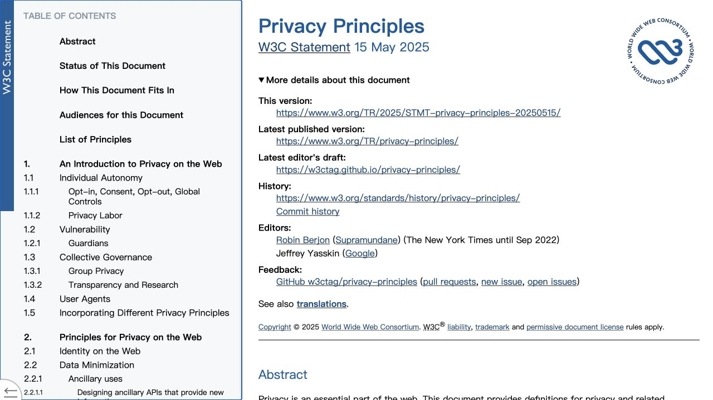

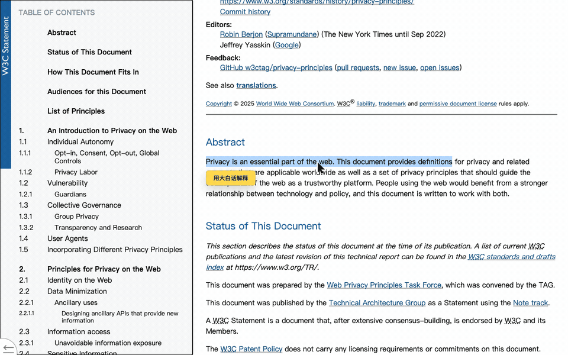

> 解释只能辅助阅读，不能替代法律意见。涉及同意授权、合同责任或个人权益时，应以原文和专业人士意见为准。

### 场景五：阅读政府办事指南

**遇到的问题：** 政府办事页面信息很多，需要先弄清楚申请、续期、材料和办理方式分别指什么。

**示例网页：** [USAGov《U.S. passports》](https://www.usa.gov/passport)

**示例内容：** `Apply for a new adult passport`

**怎么操作：** 选中这一小段标题，点击 **用大白话解释**。理解入口含义后，再按原网页链接进入具体申请要求；需要记住时点击 **加入术语库**。

**得到的帮助：** 先把英文入口转换成容易理解的中文，再回到官方页面逐项核对材料，减少点错栏目。

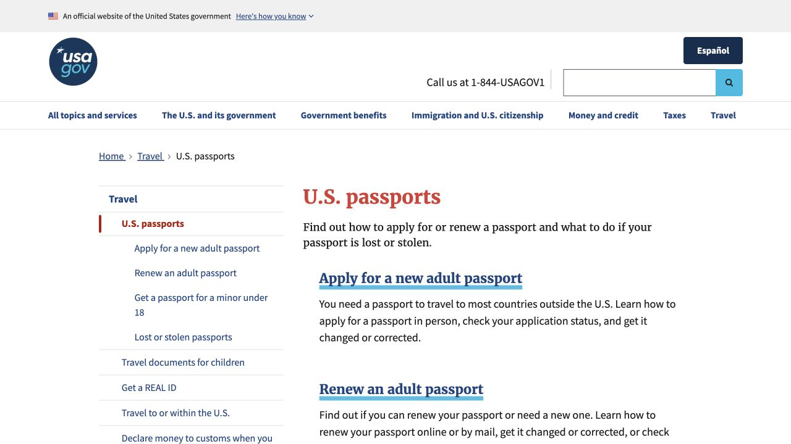

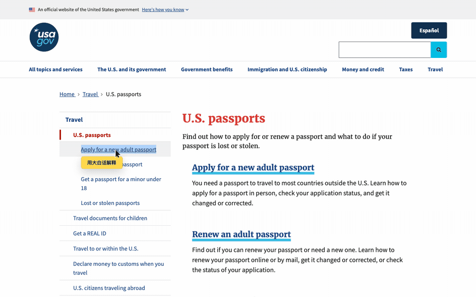

> 政策和办理要求会变化。加简大白话只帮助理解文字，实际办理应以政府网站的最新原文为准。

### 场景六：理解工作中的行业黑话

**遇到的问题：** 会议纪要或工作文档里出现 ROI、RAG、SLA、依赖、灰度发布等缩写，离开上下文后容易忘记。

**示例来源：** 自己有权阅读的会议纪要、项目说明或产品文档。不要把公司机密粘贴到不允许使用的第三方模型服务中。

**示例内容：** `SLA`、`RAG`，或一句不超过 120 个字符、且不含敏感信息的描述。

**怎么操作：** 如果内容在浏览器里，直接选中并解释；如果来自本地笔记，就在术语库顶部输入并点击 **解释并收录**。之后使用 **整理未分组** 把相关术语归到同一宽泛分组。

**得到的帮助：** 把缩写、通俗解释和生活化类比集中保存，下一次在网页中遇到同名词时直接高亮复习。

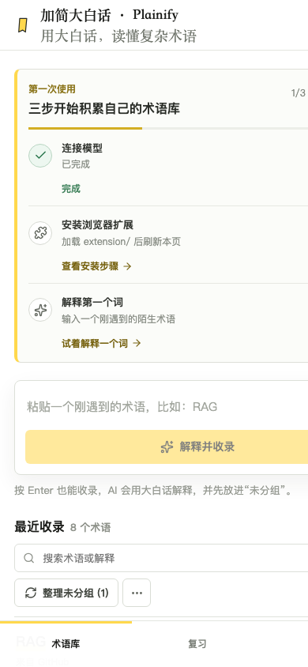

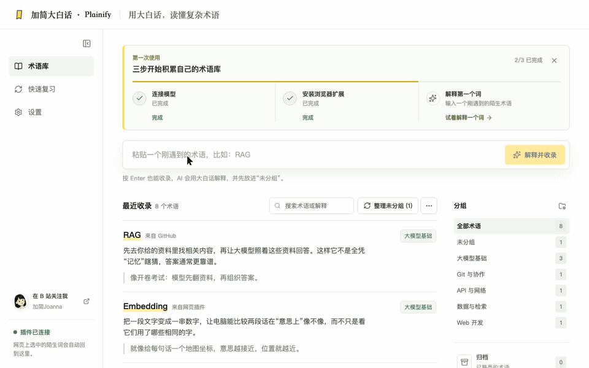

## 常见问题

### 网站打不开，或提示本机服务未连接

1. 确认打开的是 `http://127.0.0.1:5173/`。
2. macOS 用户重新双击项目中的 `install.command`，等待浏览器再次打开。
3. 手动运行的用户确认 `npm run dev` 所在的终端仍然开启。
4. macOS 用户可以在项目文件夹的终端中运行 `npm run service:status` 检查服务。
5. 仍无法连接时，重新运行 `npm run service:install`，再刷新网站。

### 网站一直显示“插件未连接”

1. 打开 `chrome://extensions` 或 `edge://extensions`。
2. 确认“加简大白话 · Plainify”已经开启，并且只有一个副本。
3. 点击扩展卡片上的 **重新加载**。
4. 回到加简大白话网站，刷新页面。
5. 打开 **设置 → 通用设置**，确认状态变为“已连接”。

### 选中文字后没有出现“用大白话解释”

1. 确认当前是普通网页，不是新标签页、浏览器设置页、扩展管理页或应用商店页面。
2. 只选中 120 个以内的字符；内容太长时拆成短句。
3. 在扩展管理页点击 **重新加载**，再刷新当前网页。
4. 检查扩展是否有当前网站的访问权限。
5. 图片、扫描件、视频字幕画面中的文字不能直接选中，需要先转成可复制文字。

### 点击解释后提示模型未配置或连接失败

1. 打开 **设置 → 模型**，确认至少有一个服务卡片显示“当前使用”。
2. 编辑该服务，重新填写 API Key。
3. 点击 **联通测试并获取模型**，必须看到“联通成功”后再保存。
4. 如果使用自定义地址，核对地址是否完整；不确定时切回“官方 API”。
5. 到模型服务商控制台确认 Key 仍然有效，并检查余额或免费额度。

余额不足时，界面会显示明确提示，本机服务会按间隔自动检查。充值到账后会自动恢复，通常不需要重启网站、后端或扩展。

### 已经收录，网页上却没有黄色高亮

1. 刷新当前网页，让最新术语同步到页面。
2. 检查该术语是否已经归档；归档内容不会高亮。
3. 确认网页实际文字与术语相同。句子被换行、插入其他标签或写法不同，都可能无法完整匹配。
4. 在扩展管理页重新加载扩展后，再刷新网页。

### 为什么没有保存原句

当前版本从网页收录时只保存页面标题和完整 URL，不保存选中内容周围的完整上下文。手动输入的术语连来源 URL 也不会自动添加。需要保留原句时，请在术语详情的解释或类比中手动补充必要信息，但不要写入隐私或机密内容。

### “记住了”和“归档”有什么区别

**记住了**只记录快速复习这一轮的结果；术语仍可能继续进入以后复习，并继续在网页中高亮。**归档**表示暂时不再复习，会把术语从首页、复习队列和网页高亮中移除，之后仍可在“归档”中恢复。

### 换浏览器或清理数据后还能恢复吗

当前版本没有账号、云同步、导出备份或自动恢复功能。网页术语数据保存在当前浏览器中，清理浏览器数据、换浏览器或换电脑都可能丢失记录。请不要把它当作唯一的长期备份。

## 隐私与安全

- 网站术语、分组和复习记录保存在浏览器的 `localStorage` 中。
- 扩展中的术语副本和偏好保存在 `chrome.storage.local` 中。
- API Key 保存在项目根目录的 `.env.local` 中，文件权限设为 `0600`，只有当前电脑用户可读写。
- 本机服务只监听 `127.0.0.1:8787`。网站和扩展不会获得完整 API Key，日志和接口响应也不会回显完整 Key。
- 生成解释时，你主动提交的文字会发送给当前选择的模型服务商。请遵守所在组织的规定，不要提交身份证号、联系方式、账号密码、商业机密或其他不应交给第三方模型的内容。
- `.env.local` 已被 Git 忽略。不要把真实 Key 写入 `.env.example`、README、截图、聊天记录或扩展压缩包。
- 当前没有云同步和内置备份功能。永久删除术语或清理浏览器数据前，请先确认不再需要这些内容。

模型生成的解释可能有遗漏或错误。法律、医疗、保险、政策、财经等专业内容只能用它辅助阅读，不能替代原文、专业意见或正式决策依据。

## 当前版本限制

- 单次解释最多 120 个字符，长段落需要拆分。
- 只有 Chrome 和 Edge 扩展经过当前版本支持和验证。
- 浏览器内部页面、禁止扩展运行的页面、图片和视频画面中的文字无法直接解释或高亮。
- 网页收录只保存页面标题和 URL，不保存完整原句上下文。
- 当前没有账号、云同步、术语导出、自动备份和间隔复习。

## 维护者验证

修改发布内容前，至少运行：

```bash
npm run lint
npm run build
npm run test:release
git diff --check
```

产品范围、需求状态和验收标准见 [docs/需求清单.md](docs/需求清单.md)。浏览器扩展的开发说明见 [extension/README.md](extension/README.md)。
